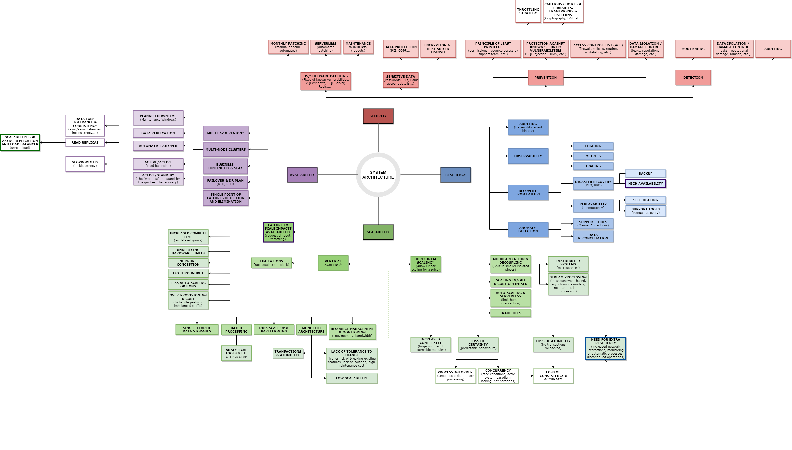

# Software Engineer Survival Guide

Murphy's law:
> Anything that can go wrong will go wrong

This repository gathers my notes so far about software architecture and engineering used when designing systems.

## General Guidelines

1. Ask the right questions to the right people; ask for tangible data & metrics
2. Challenge your plans/approaches through testing (Load Tests, DR Tests) 
3. Favor Horizontal Scaling to Vertical Scaling whenever possible
    * Vertical scaling (scaling up), you're adding more CPU/Memory/Networking resources to an existing machine
    * Horizontal scaling (scaling out), you add more resources into your system by adding more machine and distributing the workload across multiple devices
4. Know your environment: 
    * identify differences between non-prod and prod environments
    * if the main environment is hosted in AWS, learn about it 
    * if the ultimate goal is scaling, consider serverless technologies
    * understand the dynamic of permission handling and environment specific constraints

**On writing documentation**:
- 11 to 20 words a sentence. Max 25.
- People tend to scan, not read. Most people only read around 25% of what's on a page. Long, complicated sentences force users to slow down and work harder to understand what they're reading. This isn't something people want to do. People are busy, have other things to do.

**Approach to an architecture problem**
- investigate different options, compare using traffic volume information, scaling options and maintenance facilitation, pricing, etc. 

**Approach a server setup (such as SQL Server Cluster)**
- understand all requirements before starting to develop it: choice of disks, AD requirements, implications, file witness setup... 
- don't allow "semi-automation": check for automated ways of doing things before it reaches prod (after is too late)
- post-review: check what could have been improved with more knowledge

**On existing setups**
- There is probably a reason why things were implemented the way they were: don't assume there are no reasons

## Designing Systems

* [Designing Applications](./design-applications.md)
* [Designing Database Systems](./design-db-systems.md)

**Mindmap:**

